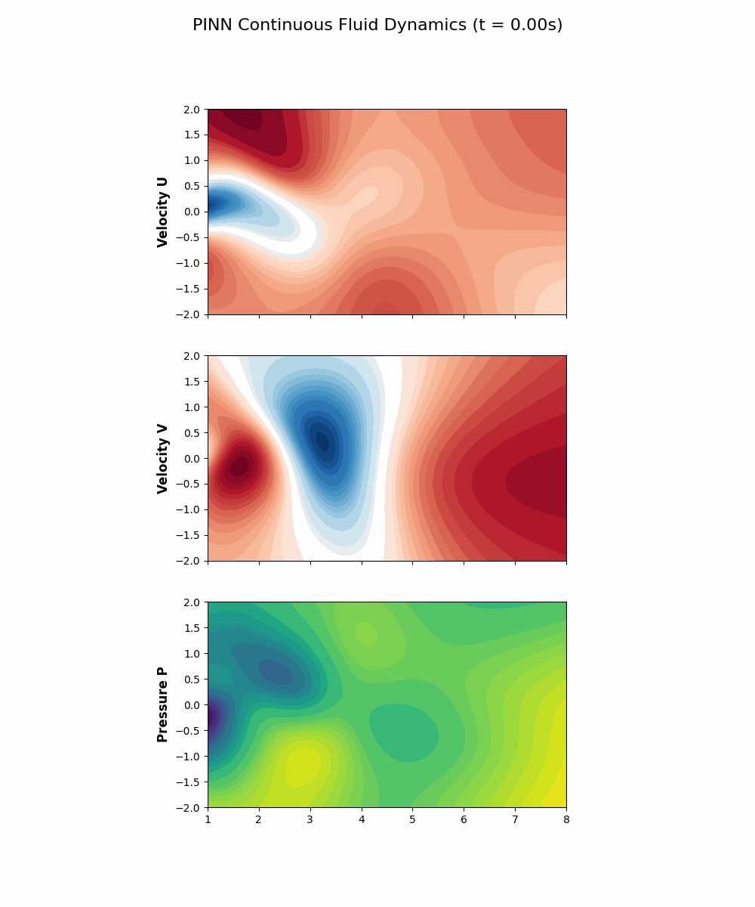
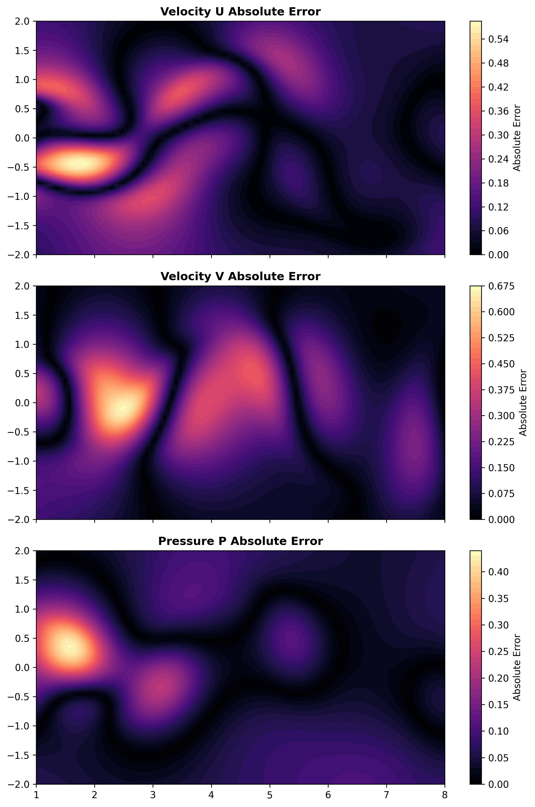
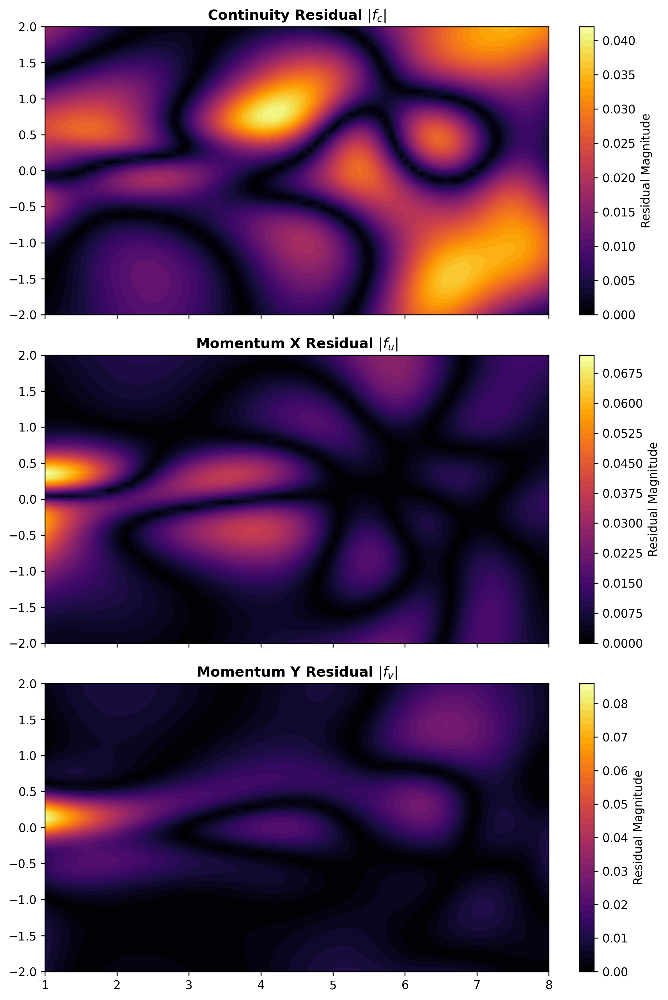
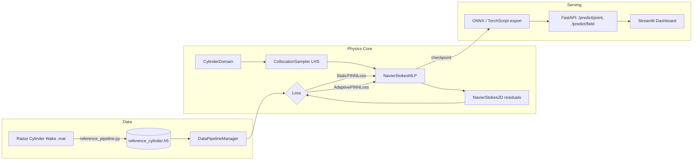

<div align="center">

# PINNFlow

**A modular, production-oriented Physics-Informed Neural Network engine for reconstructing unsteady 2D incompressible flow from sparse, noisy observations.**

[](LICENSE)
[](pyproject.toml)
[](https://pytorch.org)
[](src/api/main.py)
[](../../actions)

[Overview](#overview) • [Results](#results) • [Quickstart](#quickstart) • [Architecture](#architecture) • [API](#api-reference) • [Research](#research--methodology) • [Roadmap](#roadmap)

</div>

---

## Overview

Traditional CFD solvers (OpenFOAM, spectral methods) discretize the Navier–Stokes equations over a mesh and integrate forward in time — accurate, but slow, and unable to directly assimilate sparse, noisy sensor data into a reconstruction. PINNFlow trains a mesh-free neural surrogate that **is** the governing physics: the network's own automatic differentiation graph is used to compute the PDE residuals of the incompressible Navier–Stokes equations, which are penalized directly in the loss function alongside a small set of sparse observations.

Given a data budget of only a few hundred to a few thousand sparse, noisy point measurements of a 2D cylinder wake flow (Re = 100), PINNFlow reconstructs the full, continuous, differentiable velocity and pressure field `(u, v, p) = f(x, y, t)` — queryable at any point in space-time, including points where no data was ever observed.

**This repository is the full pipeline, not just a training script**: data ingestion, PDE-residual autograd core, two loss-balancing strategies (fixed-weight and learnable-uncertainty adaptive weighting), an experiment matrix for ablations, ONNX/TorchScript export, a FastAPI inference service, and a Streamlit visualization dashboard.

<p align="center">
  
  <br>
  <em>Reconstructed vortex street — velocity field predicted entirely by the trained network, no mesh.</em>
</p>

## Key Features

| Component | What it does |
|---|---|
| **Exact autograd physics** | `src/physics/` computes ∂u/∂x, ∂²u/∂x², continuity, and both momentum residuals via `torch.autograd.grad` — no finite differences, no discretization error in the physics term. |
| **Self-adaptive loss balancing** | `AdaptivePINNLoss` learns per-term uncertainty (Kendall et al. homoscedastic weighting) so the data term and each PDE residual term auto-balance during training, instead of relying on hand-tuned fixed weights. |
| **Data-scarcity & noise-robustness harness** | `DataPipelineManager` supports arbitrary training-budget subsampling and variance-scaled Gaussian noise injection, independent of the (always-clean) validation/test split. |
| **LHS collocation sampling** | Latin Hypercube sampling over the space-time domain with geometric rejection around the cylinder boundary. |
| **Three-way ablation matrix** | `src/experiments/run_matrix.py` benchmarks a pure data-driven MLP vs. static-weight PINN vs. adaptive-weight PINN across a budget × noise grid. |
| **Deployment-ready inference** | FastAPI REST service (point + grid queries, optional on-the-fly vorticity via autograd) + ONNX export with numerical parity verification against the PyTorch model. |
| **Interactive visualization** | Streamlit dashboard comparing PINN predictions against reference DNS data field-by-field, with L1/L2/max-error/MSE metrics. |

## Results

> Populate this table after running `src/experiments/run_matrix.py` on your hardware — these are the metrics the script already reports; do not publish placeholder numbers as findings.

| Data Budget | Noise | MSE — Data-only MLP | MSE — Static PINN | MSE — Adaptive PINN |
|---|---|---|---|---|
| 500 pts | 0% | `TBD` | `TBD` | `TBD` |
| 500 pts | 5% | `TBD` | `TBD` | `TBD` |
| 5,000 pts | 0% | `TBD` | `TBD` | `TBD` |
| 5,000 pts | 5% | `TBD` | `TBD` | `TBD` |

<p align="center">
  
  
</p>

## Architecture



```
src/
├── api/            # FastAPI service (deployed entrypoint)
├── config/         # Physical & domain constants — single source of truth
├── data/           # HDF5 ingestion, budget/noise-controlled train/val/test split
├── deployment/      # (legacy inference service — superseded by src/api)
├── evaluation/      # Failure-mode analysis, aggregate visualization
├── experiments/     # Ablation matrix, final training run, metric evaluation
├── export/          # ONNX + TorchScript export with parity verification
├── geometry/        # Domain bounds, cylinder rejection geometry
├── inference/        # Standalone inference engine used by the API
├── losses/          # Static fixed-weight & adaptive uncertainty-weighted losses
├── models/          # NavierStokesMLP (Tanh MLP, Xavier init)
├── physics/         # Autograd derivatives + Navier-Stokes residual assembly
├── sampling/         # Latin Hypercube collocation point sampling
├── training/         # Baseline / Static PINN / Adaptive PINN trainers
├── ui/              # Streamlit dashboards
└── visualization/    # Flow animation, error maps, PDE residual maps
```

## Quickstart

### 1. Install

```bash
git clone https://github.com/helloAi0/pinnflow.git
cd pinnflow
python -m venv venv && source venv/bin/activate   # Windows: venv\Scripts\activate
pip install -r requirements.txt
```

### 2. Fetch the reference dataset

The Raissi cylinder-wake dataset is not committed to this repo. Fetch and preprocess it once:

```bash
python -m src.data.reference_pipeline
```

This downloads `cylinder_nektar_wake.mat` and writes `datasets/raissi_cylinder/reference_cylinder.h5`.

### 3. Train

```bash
python -m src.training.adaptive_pinn_trainer      # quick smoke test, 5 epochs
python -m src.experiments.train_final              # full training run -> final_pinn_model.pth
python -m src.experiments.run_matrix                # full budget x noise x model-variant ablation
```

### 4. Export & serve

```bash
python -m src.export.export_model                  # -> exports/pinn_model.onnx, exports/pinn_model.pt
uvicorn src.api.main:app --reload                    # REST API on :8000
streamlit run src/ui/comparison.py                  # visual comparison dashboard on :8501
```

### 5. Or run everything in containers

```bash
docker compose up --build
```

> `Dockerfile.api` and `Dockerfile.ui` expect `final_pinn_model.pth` (and, for the UI, `datasets/`) to already exist locally — run steps 2–4 before building the images.

## API Reference

**`POST /predict/point`** — single-point query

```json
{ "x": 2.0, "y": 0.3, "t": 10.0, "compute_vorticity": true }
```

**`POST /predict/field`** — full grid query for heatmap rendering

```json
{ "x_min": -1, "x_max": 8, "y_min": -2, "y_max": 2, "t": 10.0, "nx": 100, "ny": 100 }
```

Both return `u`, `v`, `p`, `velocity_magnitude`, and optionally `vorticity` (computed via a second autograd pass through the trained network, not finite-differenced). Interactive Swagger docs at `/docs` once the service is running.

## Research & Methodology

Full governing equations, loss formulation, and the novelty comparison against Raissi et al. (2019) and Cai et al. (2021) are in [`research/methodology.md`](research/methodology.md) and [`research/literature_audit.md`](research/literature_audit.md). In short: the mathematical formulation follows the established PINN literature; this project's contribution is empirical and systems-oriented — a controlled, reproducible comparison of loss-balancing strategies under data scarcity and noise, packaged as deployable scientific software rather than a research script.

## Testing

```bash
pytest tests/
```

`tests/test_derivatives.py` and `tests/test_pde_residuals.py` validate the autograd derivative engine against known analytical solutions (Taylor-Green vortex). API and integration tests are being consolidated onto a single FastAPI `TestClient`-based suite — see [Roadmap](#roadmap).

## Roadmap

- [ ] Consolidate `src/api` and `src/deployment` into one served API; retire the duplicate
- [ ] Rewrite `tests/` around `fastapi.testclient.TestClient`, wire into CI
- [ ] Route all physical/domain constants through `src/config/physics_config.py`
- [ ] Multi-seed statistical evaluation with confidence intervals
- [ ] Uncertainty quantification (deep ensembles)
- [ ] Generalize across Reynolds number via parametric conditioning

## Citation

```bibtex
@software{pinnflow2026,
  author = {Taha},
  title  = {PINNFlow: A Modular Physics-Informed Neural Network Engine for Unsteady Flow Reconstruction},
  year   = {2026},
  url    = {https://github.com/helloAi0/pinnflow}
}
```

## License

[MIT](LICENSE)